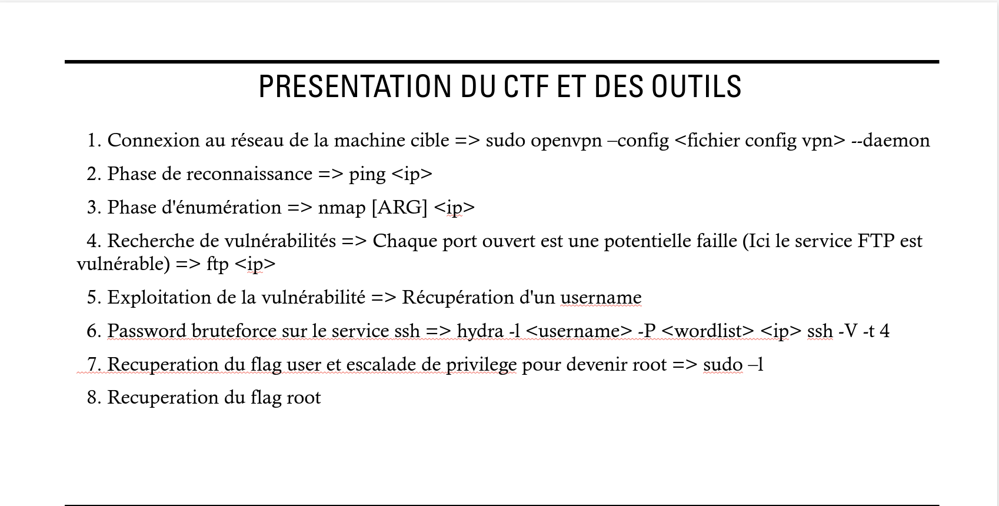

###   FOLLOW INSTRUCTIONS  ###

ROOM on TryHackMe : Brooklyn Nine Nine

Launch environment :
```
-  Download you OpenVPN file on TryHackMe and move it to this repository
-  Rename your OpenVPN file to config.ovpn
-  chmod 777 script.sh
-  ./script.sh
```
You should see a welcome message and now you are on the work environment and you can connect to the enemy Network with OpenVPN following the commands on the image below


For people who are struggling with the environment :

If you went out of the environment :
```
- docker start -i ctf19_instance
```

If you have an error while lauching environment
```
- chmod 777 clean.sh
- ./clean.sh
- Then try again the first 4 steps
```

If it still doesnt work then ask to Kamron or Vicente


###   COMMANDS   ####


###   Mini solution  ###




