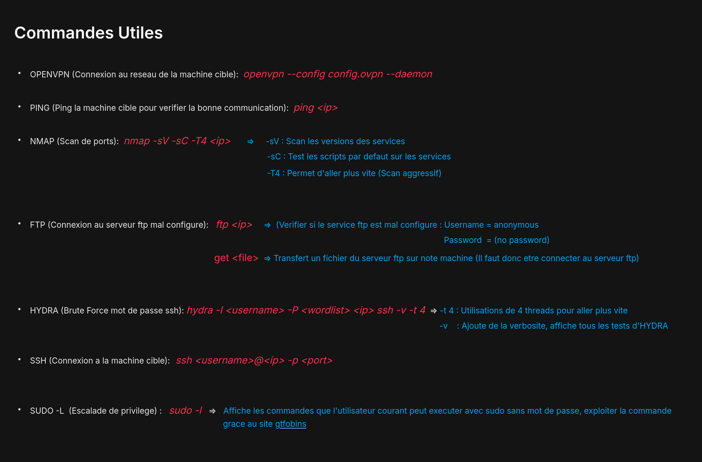

###   FOLLOW INSTRUCTIONS  ###

Launch environment :
```
-  Download you OpenVPN file on TryHackMe and move it to this repository
-  Rename your OpenVPN file to config.ovpn
-  chmod 777 script.sh
-  ./script.sh
-  Open new terminal to see the commands.txt in the repo
```
If you went out of the environment :
```
- docker start -i ctf19_instance
```

If you have an error while lauching environment
```
- chmod 777 clean.sh
- ./clean.sh
- Then try again the first 4 steps
```

If it still doesnt work then ask to Kamron or Vicente


###   COMMANDS   ####




